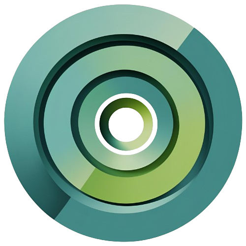
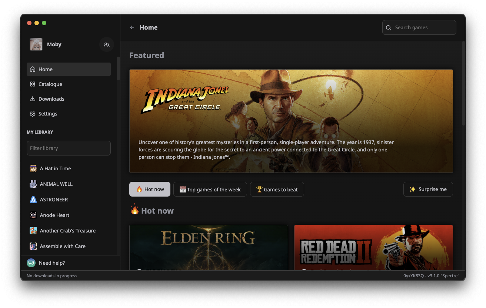

  <h1 align="center">Nimbus Launcher</h1>

  

    <strong>Nimbus Launcher is an open-source gaming platform created to be the single tool that you need in order to manage your gaming library. Nimbus is written in Node.js (Electron, React, Typescript) and Python.</strong>
  

## Features

- Add games that you own to your library
- Have a nice profile that shows what you are playing to your friends
- Save your game progress in the cloud with Nimbus Cloud
- Unlock achievements
- Navigate through a rich catalogue with a powerful suggestion algorithm
- Discover new games that you haven't played before

## Build from source and contributing

Please, refer to our Documentation pages: [docs.nimbuslauncher.gg](https://docs.nimbuslauncher.gg/getting-started)

## License

Nimbus is licensed under the [MIT License](LICENSE).
